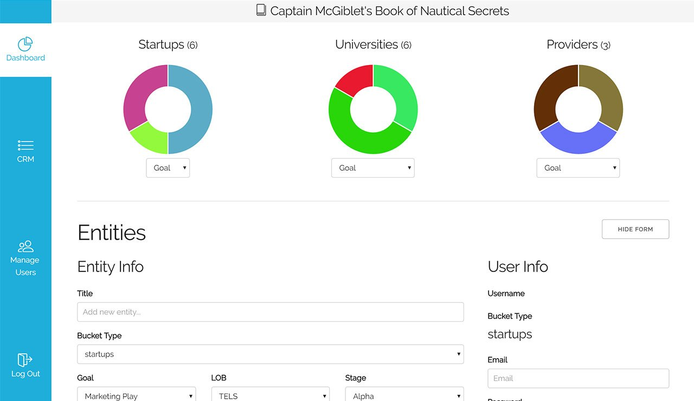

"Captain McGiblets Book of Nautical Secrets", a CRM and project tracking tool, was one of the first projects I did using React. This was another project with my friends at <a href="/ics">ICS</a>. Built on <a class="effect-3" href="https://www.meteor.com/" target="_blank">MeteorJS</a> and <a class="effect-3" href="https://facebook.github.io/react/" target="_blank">React</a>, this web app is blazing fast and fun to use!

User roles were a big priority for the end product. Different levels of users can view different entities entered into the CRM and monitor updates associated with their projects, posted by lower-level users. These updates can even include different attachments of any type!
