Back in 2011 I did an internship as an illustrator at the Santiago Times, which is an English-language news source in, you guessed it, Santiago, Chile.

The journalists and I would meet with the editor and have a morning "pauta", in which I was given 2-3 drawing assignments to go with the articles that the writers were working on. I am not sure if they wanted such goofy drawings, but I had a lot of fun doing them. These are mostly pencil, marker, and photoshop.

I apologize, I don't remember the headlines of a lot of the articles, but I'll provide captions where I can.

Apparently Chileans were being caught smuggling cars into Bolivia.

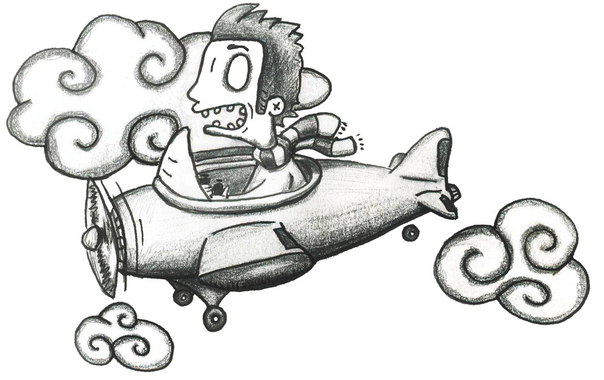

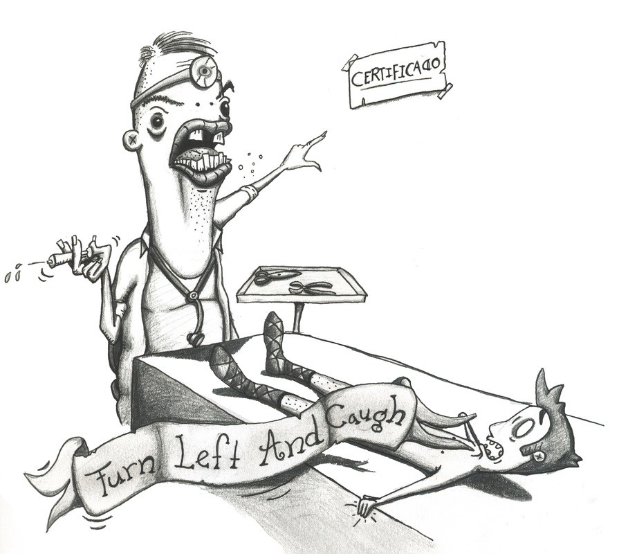

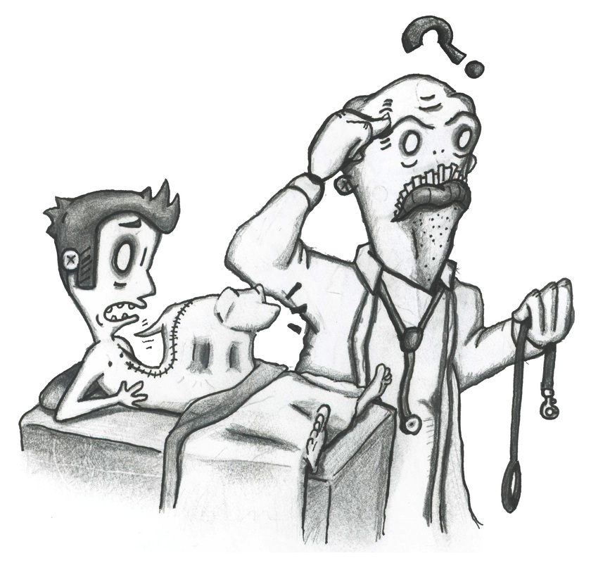

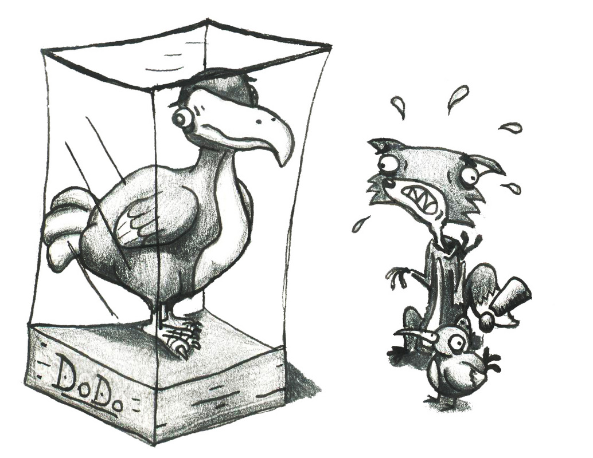

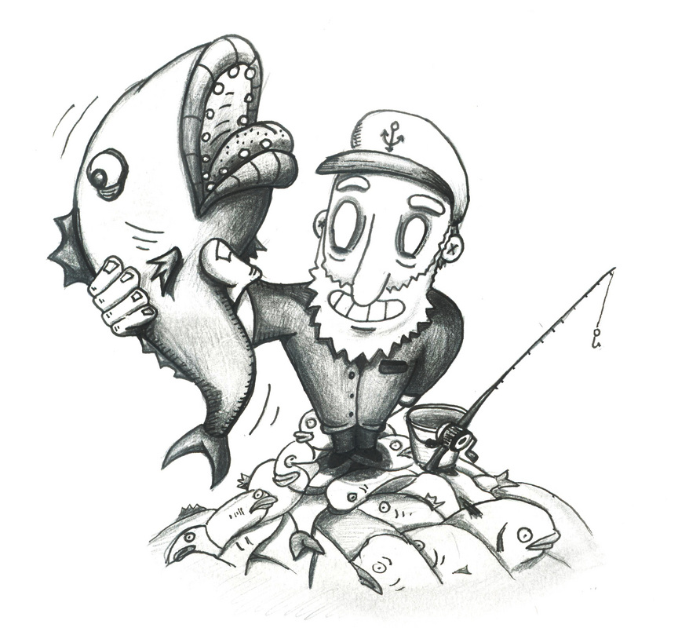

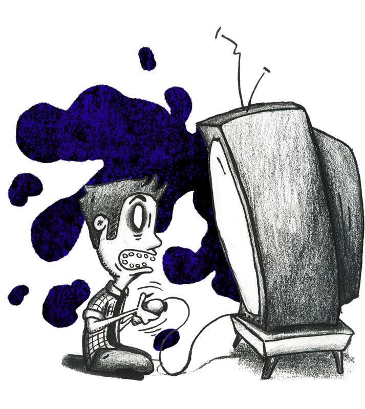

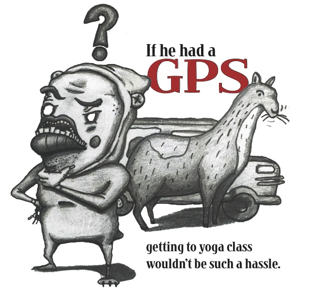

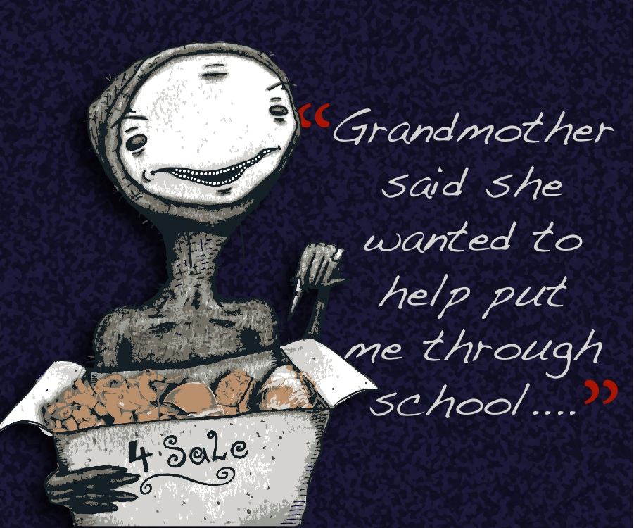

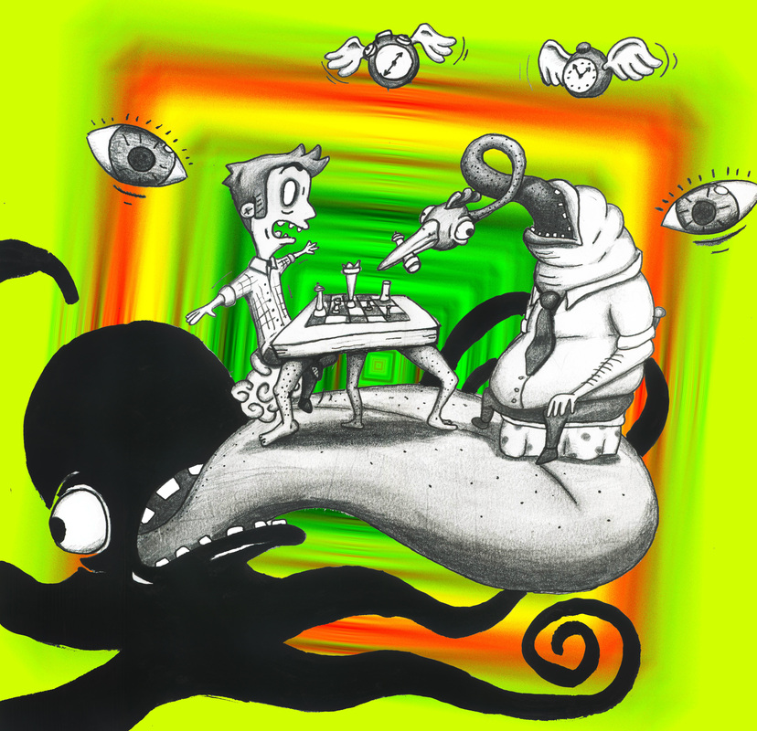
For an article on the rise of LSD in Chile

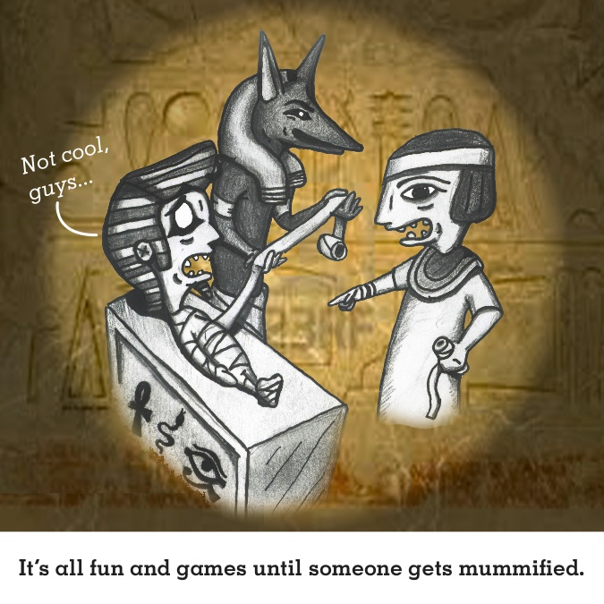

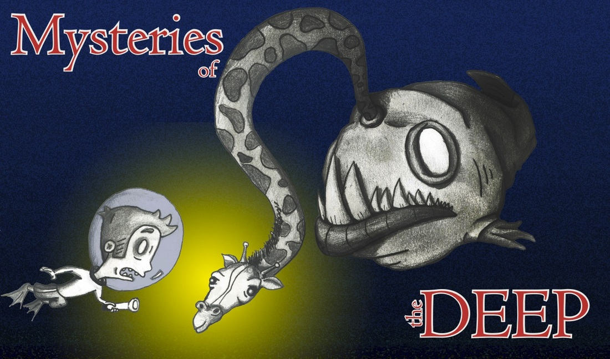

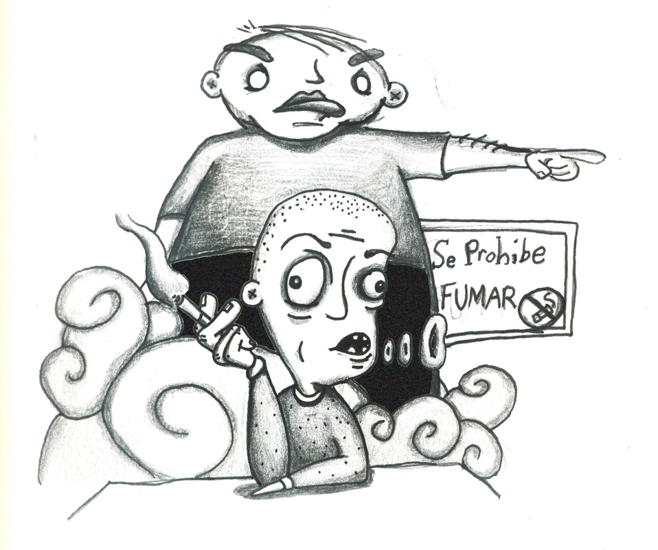

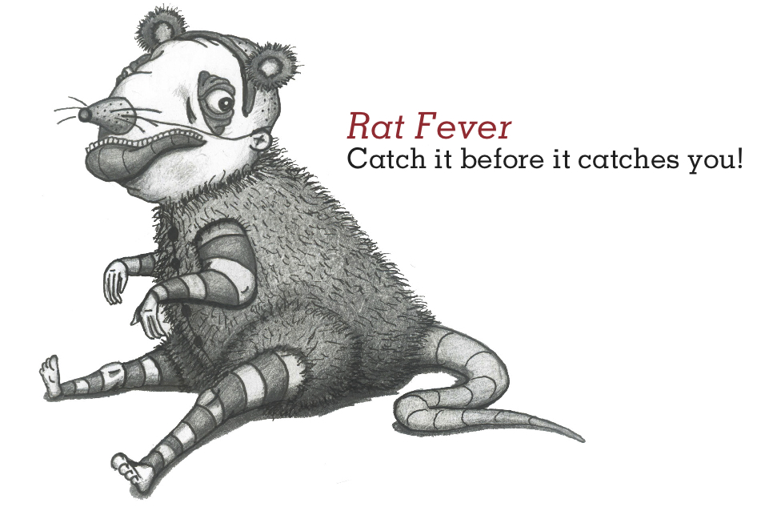

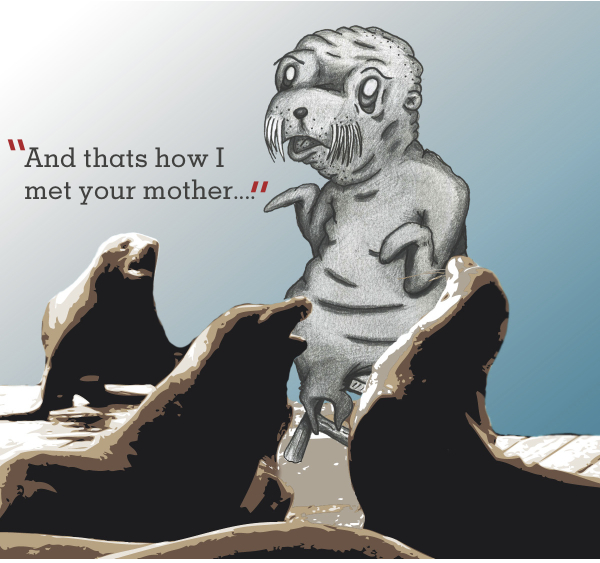

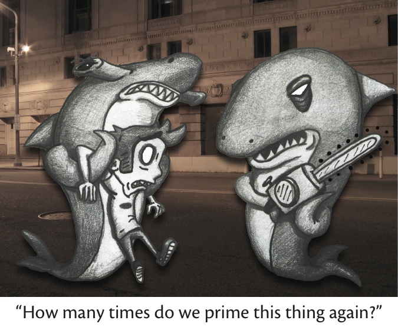

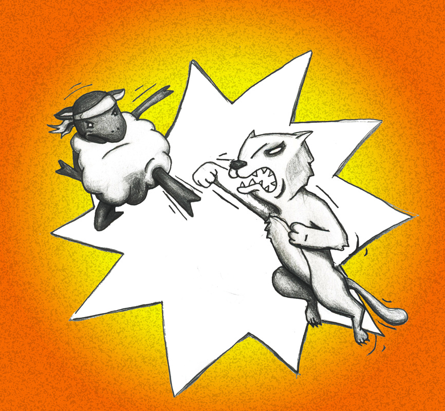

