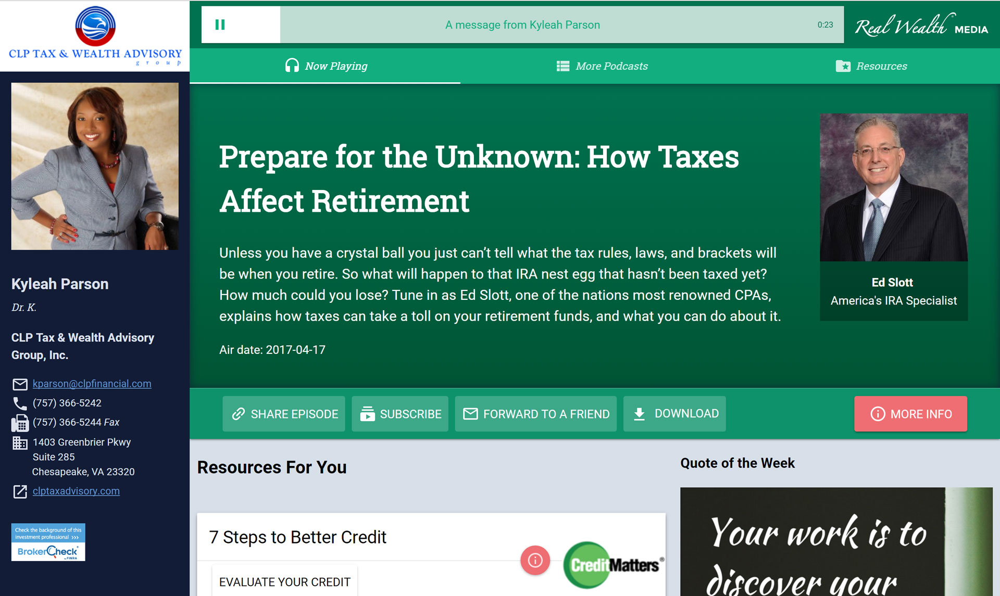
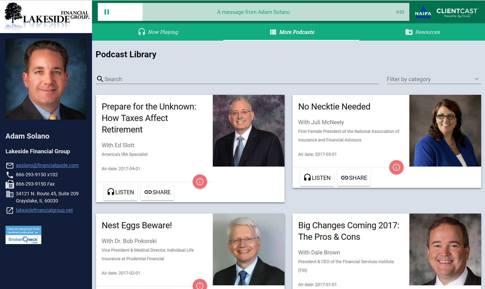
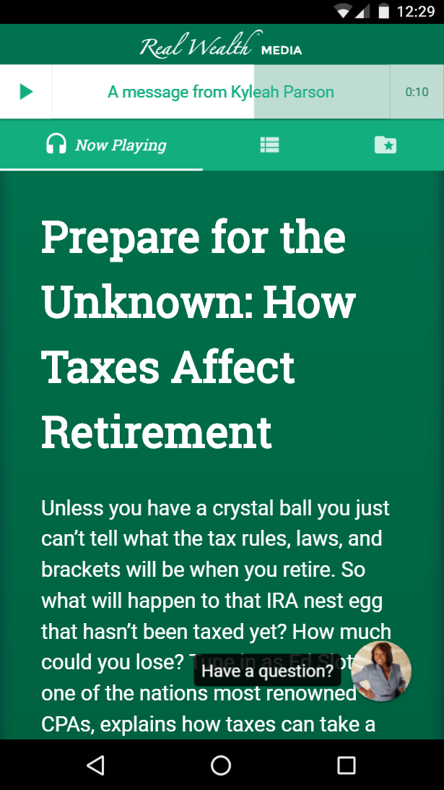

## Polymer
As a replacement for the WordPress version of the _Real_ Wealth&reg; Media, I decided to build a progressive web app using web components and specifically Polymer. This is exciting new web technology and brings the web to the same level of quality you get with native apps!

## Why Progressive web app?
Real wealth wanted to keep it web based
offline
app shell

## WordPress Data
Thought the polymer app is purely front-end, there is a WordPress site that the Real Wealth team uses to manage the podcast library, users, and all sorts of data that is fed to the app. This is made possible by using the WP-JSON API, which is now part of the WordPress core! Very exciting stuff.

